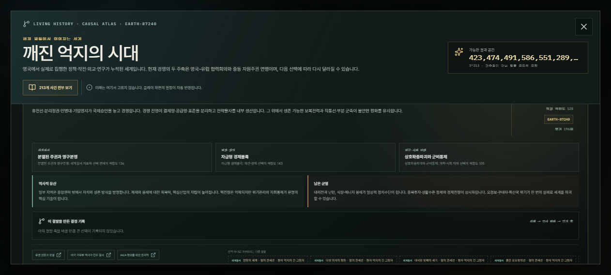
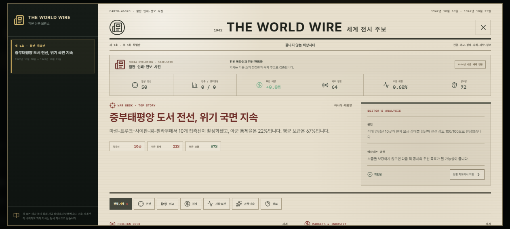
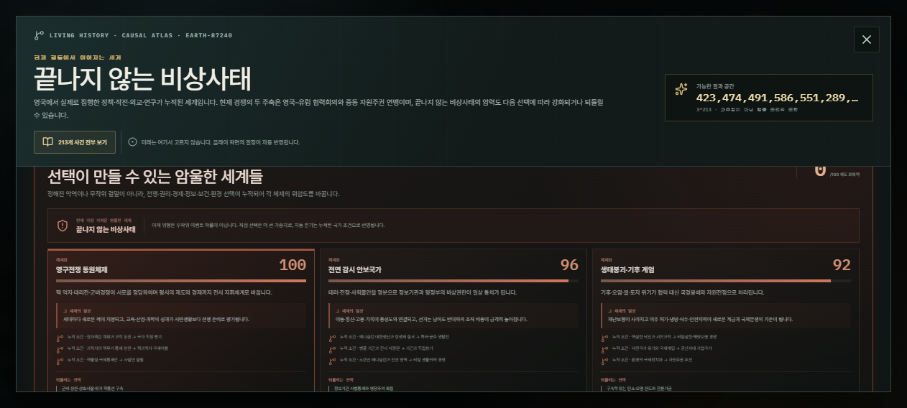

# 국가별 3,000개 가능세계 조합 전수 검증 및 개선 보고서

## 결론

13개 플레이 국가에서 각각 3,000개, 총 39,000개의 서로 다른 1942–2060 경력을 실행했다. 각 경력은 행동 성향만 바꾼 반복 시드가 아니라 전쟁 교리, 국가 전략, 전환 방식, 국가 의제, 정치 위기 대응, 경제, 외교, 기술, 보건, 전쟁 태세, 미래 우선순위, 선거 방식과 세계 사건 대응을 조합한 별도 정책 지문을 갖는다.

최종 행렬은 8,307,000건의 역사·미래 사건 선택을 처리했다. 39,000개 정책 조합과 39,000개 미래 경로가 모두 고유했고 경로 충돌은 0%였다. 전체 생존 가능한 경력은 89.5%로, 선택을 잘못해도 무조건 성공하던 초기 100% 수렴을 제거하면서 모든 국가에 회복 가능한 경로를 남겼다.

보고서의 권고를 다시 실제 코드에 적용한 뒤 같은 조건으로 전수 재실행했다. 행동 성향과 세계 대응의 최소 장기 민감도 기준을 1점에서 1.5점으로 올렸고, 실제 주간 앵커는 78개 표본에서 169개 전 보직 표본으로 확장했다. 가능세계 행렬과 주간 엔진의 국가성과 순위 상관은 0.659로, 두 계층이 똑같은 값을 내는 대신 공통된 국가 구조와 서로 다른 주간 운영 결과를 함께 보존했다.

## 검증 구조

고용량 검증을 두 층으로 나눴다.

1. 가능세계 행렬은 39,000개 경력 모두에서 213개 역사·미래 사건군, 12개 시대 구간, 국가별 전환·구조 불안·위기·선거·전쟁·감염병·기술 결과를 계산한다.
2. 실제 주간 엔진 앵커는 국가별 13개 보직을 모두 포함한 169개 경력을 6,136주씩 실행한다. 총 1,036,984번의 실제 주간 상태 전이를 통해 전투, 보급, 경제, 연구, 참모, 정치 위기와 결말 연결을 확인한다.

가능세계 행렬은 광범위한 조합과 결과 분포를 찾는 전수 계층이고, 주간 앵커는 축약 계층이 실제 게임 엔진과 다른 규칙을 만들지 않았는지 확인하는 정밀 계층이다.

## 발견한 문제와 수정

### 1. 성향 프리셋의 선택 결합

기존 장기 엔진은 6개 행동 성향이 교리, 국가 전략, 세계 사건 선택, 선거 행동과 예산 방향을 함께 고정했다. 표본 수를 늘려도 실제 정책 조합은 반복됐다.

- 4,320칸 혼합 기수 조합 공간을 추가했다.
- 국가별 0–2,999번 시나리오는 조합 코드와 조합 키가 절대 중복되지 않는다.
- 핵심 6축은 조합 고유성을 보장하고 나머지 8축은 독립 해시로 배치해 축 사이의 인위적 상관을 제거했다.
- 실제 주간 엔진도 같은 시나리오 지문을 받아 교리, 국가 전략, 전환 시기, 의제, 위기 대응, 예산, 전투 태세, 선거 방식과 결말에 반영한다.

### 2. 영향 없는 선택

첫 39,000회 집계에서는 교리·전환·위기·보건·전쟁·세계 대응 일부가 국가 점수만 보면 영향이 거의 없는 것으로 나타났다. 전환 시기나 감염병 수처럼 다른 결과를 바꾸고도 계측하지 못한 경우와 실제로 장기 비용이 부족한 경우가 섞여 있었다.

- 민감도 계측을 국가 점수·불안·번영에서 전환 연도, 지속가능성, 정치 위기, 분쟁, 감염병, 선거 승률까지 확장했다.
- 교리는 권리·안보·지속가능성, 세계 대응은 권리·안보·기술, 위기 대응은 국민 위임·권리·안보에 별도 비용과 보상을 준다.
- 행동 성향도 직접적인 장기 트레이드오프를 갖는다. 속도 중시는 번영과 불안을, 군사 중시는 안보와 권리를, 국가 건설은 번영·위임·제도를, 완결성 중시는 기술·지속가능성을, 기회주의는 번영·다극성과 불안을 함께 바꾼다.
- 최종 39,000회에서는 14개 모든 선택 축이 최소 한 가지 장기 결과를 1.5점 이상 변화시켰다. 가장 약한 베트남의 세계 대응도 정확히 1.5점을 기록했다.

### 3. 정치 위기 0회와 성공 100% 수렴

첫 행렬에서는 정치 위기가 한 번도 발생하지 않았고 모든 국가가 생존했다. 반대로 단순 위험 상향 후 표본에서는 베트남·중국 등 취약 국가에 20회가 넘는 위기가 집중됐다.

- 정치 위기는 한 시대 구간에 최대 한 번만 발생하도록 세대 단위 사건으로 제한했다.
- 불안, 국민 위임, 세계 불안정, 국가별 위기 편향과 사용자의 대응 방식을 확률에 함께 반영했다.
- 해방·탈식민·내전 이후 국가는 체제 단절 한 차례를 더 흡수할 수 있어 높은 초기 난이도가 자동 패배로 이어지지 않는다.
- 최종 국가별 평균 위기는 영국 0.4회에서 중국 4.5회 사이이며, 생존 가능 경력은 독일 79.0%, 베트남 79.8%, 한국 92.3%, 미국 98.5%처럼 역사 구조와 선택에 따라 달라진다.
- 실제 주간 엔진에서는 저지·타협·체제 전환을 최근 24건의 제도 기억으로 보존한다. 저지 경험, 탐지 경험과 새 정부 세대가 다음 대응 성공률과 재발 대기기간을 높인다.
- 78경력 기준 성공한 권력구조 교체 평균 3.68회가 169경력 재검증에서 1.1회로 줄었다. 위기는 사라지지 않지만 같은 정부가 수년마다 반복해서 전복되는 현상은 제거했다.

### 4. 세계 사건 탐색 성능

주간 엔진은 해결된 세계 사건을 찾을 때 사건 목록과 완료 결정 전체를 반복 순회했다. 118년 커리어 후반으로 갈수록 비용이 제곱으로 증가했다.

- 해결 사건을 한 번의 순회로 Set과 최신 사건으로 색인한다.
- 주간 엔진에서 완료 사건 수를 이미 계측 중인 카운터로 재사용한다.
- 번들 기준 단일 118년 커리어 실행 시간은 약 27.7초에서 9.1초로 67% 줄었다.

### 5. 전시 결재 과밀과 단계별 리듬 은폐

기존 집계는 전시와 평시 결정을 합산해 장기 평시가 전쟁 초반의 과밀을 가렸다. 분리 계측을 추가하자 첫 169경력에서 전시 결재가 국가별 연 31.3–40.5회로 나타났다.

- 전시·평시 결정 수를 별도 계측하고 각각 연 6–26회의 회귀 범위를 적용했다.
- 이미 확인·검증 중인 행동을 자동 플레이가 다시 처리하던 오류를 고쳤다.
- 생산·연구·보건·인사 정비는 하나의 분기 지휘 브리핑으로 묶고, 전투는 교리별 작전 주기에만 개시한다.
- 최종 재검증에서 전시는 연 15.2–16.5회, 평시는 7.4–9.3회로 안정됐고 국가 간 격차는 각각 1.3회와 1.9회다.

### 6. 보직·권한 표본 누락

국가별 6개 표본은 행동 성향은 모두 포함했지만 13개 보직 중 6개만 지나가 실제 보직 범위가 78/169, 권한 계열이 2/3에 머물렀다.

- 국가별 앵커 수를 13개로 확장해 각 역할 ID를 한 번 이상 실행했다.
- 5개 직급, 군사·정치·정보 3개 계열, 6개 행동 성향을 동시에 계측한다.
- 최종 결과는 보직 169/169, 계열 3/3, 직급 5/5, 2060년 완주 169/169다.

### 7. 결과는 보이지만 원인이 보이지 않던 화면

- 세계사 결말 화면에 세계선 코드, 분기 횟수와 최근 6개의 결정 인과 기록을 추가했다.
- 각 기록은 연도, 사건, 사용자의 선택, 즉시 결과, 바뀐 장기 축을 `선택 → 결과 → 장기 축` 순서로 보여준다.
- 가까운 대체 결말에는 세계질서·경제재건·과학사회 중 어떤 축이 달라지는지 표시한다.

### 8. 구조 불안의 실행 가능한 대응

- 구조 압력 상위 5개 원인마다 연결 예산, 구체 행동, 예상 효과와 4주 또는 13주 뒤 확인 시점을 제공한다.
- 지역 격차, 정체성, 불평등, 주거, 세대, 인구, 환경, 제도 노후와 생활비 충격이 서로 다른 정책 지렛대를 사용한다.
- 정치 위기 화면에는 과거 대응 학습으로 얻은 성공률 보너스와 최근 24건의 위기 대응 기록을 함께 표시한다.

### 9. 시대에 따라 진화하는 세계 보도

- 세계 주보를 1942–1953년 활판 전시 주보, 1954–1967년 라디오 통신, 1968–1988년 텔레비전 뉴스, 1989–2004년 위성 24시간 보도, 2005–2015년 웹 에디션, 2016–2034년 모바일 라이브 피드, 2035–2060년 분산형 시민 보도망의 7단계로 나눴다.
- 기사 내용만 바뀌는 장식이 아니라 제호, 아이콘, 편집실, 발행 주기, 기사 검증 방식, 아카이브 이름과 화면 구성이 함께 바뀐다.
- 각 과거 호는 발행 당시 매체 형식을 보존한다. 2060년에 1942년 기사를 열어도 종이신문으로 보이며, 기존 저장 파일은 발행 주차를 기준으로 자동 이관된다.
- 현재 매체의 시작·종료 연도와 다음 전환 시점을 기사 상단에서 바로 확인할 수 있다.

### 10. 사용자의 선택으로 형성되는 디스토피아 세계

- 감시 안보국가, 영구전쟁 동원체제, 기업주권, 봉쇄경제 요새국가, 상시 생물안보, 알고리즘 신분사회, 생태붕괴 기후계엄의 7개 암울한 세계를 별도 압력 모델로 설계했다.
- 프롬프트나 무작위 추첨으로 결말을 고르지 않는다. 213개 사건군의 전쟁·권리·경제·정보·보건·환경 선택과 현재 세계 지표가 각 위험도를 바꾼다.
- 사용자가 직접 선택한 분기는 자동 전망보다 큰 가중치를 받고, 각 카드에 직접 선택 횟수와 `선택 → 체제 압력` 원인이 기록된다.
- 각 세계는 위험도와 체제화 단계뿐 아니라 그 세계의 시민 일상, 현재 원인, 되돌릴 수 있는 세 가지 제도 선택을 함께 보여준다.
- 권리 확대·공개 사찰·개방 통신망을 선택한 세계와 탄압·핵교환·사고 은폐·폐쇄망을 선택한 세계가 동일 시드에서도 다른 감시·영구전쟁 위험을 내는 회귀 테스트를 추가했다.

## 최종 39,000회 결과

| 지표 | 초기 전수 집계 | 최종 전수 집계 |
| --- | ---: | ---: |
| 국가별 조합 | 3,000 | 3,000 |
| 전체 고유 조합 | 39,000 | 39,000 |
| 처리한 역사·미래 사건 선택 | 8,307,000 | 8,307,000 |
| 고유 미래 경로 | 39,000 | 39,000 |
| 미래 경로 충돌률 | 0% | 0% |
| 결말 분류 충돌률 | 94.3% | 37.1% |
| 단일 결말 최대 점유율 | 국가별 최대 2.4% | 국가별 최대 0.3% |
| 생존 가능한 경력 | 100% | 89.5% |
| 정치 위기 | 전 국가 평균 0회 | 국가별 평균 0.4–4.5회 |
| 장기 영향 1.5점 미만 선택 축 | 다수 | 0개 |

결말 분류는 같은 정치·경제·세계질서 범주를 공유할 수 있으므로 충돌률 자체가 0일 필요는 없다. 중요한 지표는 세부 미래 경로 충돌 0%, 단일 결말 점유율 0.3% 이하, 국가별 고유 결말 1,728–2,028개다.

## 실제 주간 엔진 앵커

- 13개 국가 × 13개 전 보직 = 169개 경력
- 1942–2060, 경력당 6,136주
- 총 1,036,984주 상태 전이
- 2060년 도달률 100%
- 실제 보직 169/169 · 직급 5/5 · 권한 계열 3/3 · 행동 성향 6/6
- 전환 유형 6종 확인
- 결말 충돌률 0%
- 전시 연간 결정 15.2–16.5회 · 평시 7.4–9.3회
- 경력당 정치 위기 3.7회 · 성공한 권력구조 교체 1.1회
- 국가별 고유 결말 13/13
- 모든 자동 진단 결과 P2(해결·건강 범위)

## 재실행 및 산출물

- 전수 보고서: `docs/possibility-matrix-3000-2060.md`
- 전수 집계: `docs/possibility-matrix-3000-2060-summary.json`
- 13개 국가별 보고서·집계·압축 원자료: `docs/possibility-matrix-3000-2060-nations/`
- 실제 주간 앵커 보고서: `docs/possibility-matrix-weekly-anchor-13-2060.md`
- 실제 주간 앵커 집계: `docs/possibility-matrix-weekly-anchor-13-2060-summary.json`
- 실제 주간 앵커 국가별 원자료·집계·보고서: `docs/possibility-matrix-weekly-anchor-13-2060-nations/`
- 조합 생성기: `src/centuryScenario.ts`
- 가능세계 분석 엔진: `src/possibilityMatrixPlaytest.ts`
- 전수 실행기: `scripts/run-possibility-matrix-3000-2060.ts`
- 시대별 매체 전환 규칙: `src/newsMediaEvolution.ts`
- 선택 기반 암울한 세계 압력 모델: `src/dystopianWorlds.ts`

기본 재실행 명령은 `npm run playtest:possibilities`다. 대규모 검증에서는 실행기의 `--worker`와 `--merge` 모드를 사용해 작업을 병렬화할 수 있다.
